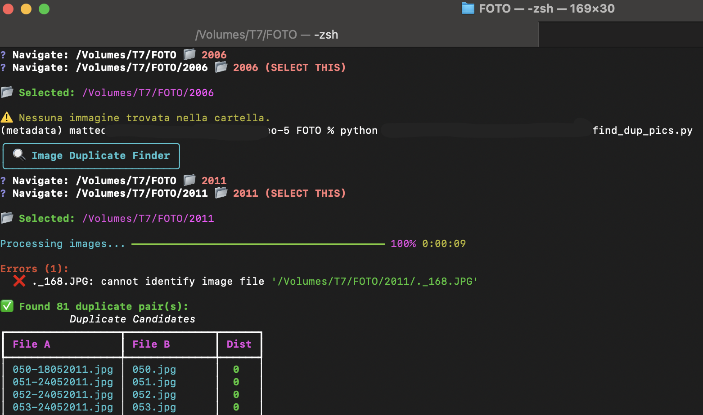

## Working with metadata

Repository storing scripts to extract and work with metadata.

- `pic_dates.sh` &rarr; extracts original creation date from `jpg` files via `mdls` and appends it to the filename for easier identification.
- `find_dup_pics.py` &rarr; prints pairs of pictures that are identical or similar in content to identify duplicates faster; uses `imagehash`, $O(n^2)$ execution time. Allows replication across folders via handy menu in rich text, implemented with `questionary` library.

  

  find_dup_pics.py</code>" width="900" height="500">

